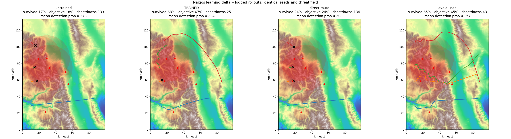

# Naigos

Survivable routing in contested 3D airspace. Aircraft learn to reach an
objective through a field of active threats — radar/SAM sites, mobile ground
units, interceptor drones — while scripted red behaviour and a difficulty
curriculum make the field progressively harder.

**The blue agent is purely evasive. It has no weapon and no offensive action, ever.**
Its entire action space is three flight controls: bank, flight-path angle,
throttle. It survives by routing, timing, terrain masking and manoeuvre — never
by removing a threat. This is enforced in code (`config.BLUE_ACTION_NAMES`) and
by `tests/test_invariant.py`, not by a comment.

The measurable claim: **detection probability and shootdowns down,
objectives-reached and sorties-preserved up, against a naive direct-route
baseline.**

## Result

1000 MAPPO-Lagrangian iterations on the cited Owens Valley theatre
(`checkpoints/theatre_1000.pkl`, shipped). Evaluated on held-out demo seeds, 48 worlds x 4 aircraft, with identical
seeds and an identical threat field across all four policies:

| | untrained | **trained** | naive direct route | avoid+nap heuristic |
| --- | --- | --- | --- | --- |
| sorties surviving | 0.172 | **0.677** | 0.240 | 0.646 |
| objectives reached | 0.177 | **0.672** | 0.240 | 0.646 |
| shootdowns (of 192) | 133 | **25** | 134 | 43 |
| mean detection probability | 0.376 | **0.224** | 0.268 | 0.157 |

Against the naive direct route: shootdowns fall 5.4x, objectives-reached rise
2.8x, detection probability falls 0.268 → 0.224 — the tradeoff `prompt.md` asks
to be measured, in the direction it asks for. The demo prints this table itself;
it is not transcribed by hand.

Measured at 500 m terrain cells with `los_samples=96`. Earlier published figures
used 1500 m / 24, which over-reported visibility by ~50% relative at low
altitude; see [next-steps.md](next-steps.md) for the convergence data. The
correction lowers detection for every policy and, notably, flips the comparison
with the hand-written heuristic.



Raw numbers: [`docs/artifacts/summary.json`](docs/artifacts/summary.json),
[`summary_cbf.json`](docs/artifacts/summary_cbf.json), and the full training curve in
[`history.json`](docs/artifacts/history.json). `runs/` is gitignored; these are the
committed copies.

Three caveats that belong next to that table, not in a footnote:

- A **hand-written avoid-plus-nap heuristic remains the real bar.** Under the
  corrected line-of-sight model the policy now edges it on survival (0.677 vs
  0.646) and on terrain losses (15 vs 25), but the heuristic still flies
  markedly quieter (detection 0.157 vs 0.224). It is a first-class baseline in
  the demo and in every training eval, because beating only the naive route
  would be a weak claim.
- **Single seed, single theatre, single route geometry.**
- The policy wins by **climbing above the short-range engagement ceilings**, not
  by terrain masking. That is a legitimate tactic it found on its own, but it is
  not the signature mechanic the design intended. Diagnosed in detail in
  [next-steps.md](next-steps.md) V-1.

## Watch it live on a globe (CesiumJS)

```bash
uv run python -m naigos.demo.live --aoi tehran_basin --open
```

Steps the environment continuously and streams it to CesiumJS over Server-Sent
Events at `http://localhost:8765`, **over real 3D terrain**.

On a fresh clone, populate that theatre's ignored raw-data cache first:
`uv run naigos-research --aoi tehran_basin`. The setup section below explains
why the cited specs are committed while their raw artifacts are not.

The globe is **two layers, and they are not interchangeable**:

| layer | source | role |
| ----- | ------ | ---- |
| **terrain** — the physics | the simulation's own heightmap, served from `/terrain` | The surface every line-of-sight ray was computed against, and the only elevation data the detection model consumes. |
| **imagery** — the skin | Copernicus Sentinel-2, Cesium ion asset 3954 | Cosmetic. Makes the scene read as real geography. **No satellite pixel ever enters an observation.** |

(That table describes the default `--visual physics`. The optional
`--visual photorealistic` mode replaces the surface with Google's 3D Tiles and is
explicitly *not* evidence — see [below](#two-visual-modes-and-only-one-of-them-is-evidence).)

The split is the point. The globe's relief is *evidence* — take it from an
imagery provider and the viewer is illustrating terrain masking rather than
demonstrating it, which is a defect this repo already shipped once
([next-steps.md](next-steps.md) E-9). Press **imagery** in the layer panel to
strip the skin off: the relief, the hillshade and every LOS ray stay exactly
where they were. `tests/test_imagery_layers.py` asserts that no ion *terrain*
provider is ever constructed and that nothing under `naigos/env` or `naigos/rl`
so much as names imagery.

The globe's surface is the simulation's own heightmap, served from `/terrain` and
fed to Cesium through `CustomHeightmapTerrainProvider` — so what occludes on
screen is what occluded in the model, verified to a mean of 1.65 m against the
env's own sampler. Aircraft are depth-tested: they genuinely vanish behind
ridges, which is the visual proof of the mechanic (press **x-ray** to see them
through terrain). A **LOS ray** is drawn to whichever threat has the best look at
each aircraft, coloured red when the ray is clear, amber when grazing, and green
when a ridge is cutting it. Hillshade is computed in the browser from that same
height array, so the shading cannot disagree with the geometry.

To scrub a recorded rollout on the same globe:

```bash
uv run python -m naigos.demo.live --aoi owens_valley --replay runs/demo/demo.json --open
```

Recordings are tagged with their theatre; replaying one against a different AOI
is refused rather than silently relocating the sortie to the wrong continent. This is a **live simulation, not a replay**:
a worker thread runs `NaigosEnv` forever with the trained policy, and aircraft
are re-tasked through `env.respawn` the instant a sortie ends, so the theatre
never empties. Cumulative counters (sorties launched, objectives reached, shot
down, terrain and out-of-bounds losses, success rate) accumulate as it runs.

```bash
--aoi owens_valley     # the other theatre
--speed 60             # sim seconds per wall-clock second (default 10)
--blue 6 --threats 14  # cohort and threat-field size
--red-level 0.6        # red curriculum difficulty, 0-1
--cbf                  # run the HOCBF-QP backstop
--reroll 1200          # re-draw the threat field every N sim seconds
--visual physics       # default. --visual photorealistic for Google 3D Tiles (see below)
--ion-token <token>    # Sentinel-2 imagery skin via Cesium ion (or set NAIGOS_CESIUM_ION_TOKEN)
--imagery sentinel2    # base-layer skin; use --imagery osm to force the keyless one
--port 8765
```

**No Cesium ion token is needed.** Without one the viewer uses keyless
OpenStreetMap imagery; with one it uses Copernicus Sentinel-2 imagery via Cesium
ion. That choice is cosmetic: in both cases the relief is the simulation's own
heightmap from `/terrain`, not provider terrain. The imagery toggle makes this
separation visible in the browser.

### Two visual modes, and only one of them is evidence

`--visual` picks between two whole postures. They differ in what the drawn
surface *is*, which is why this is a mode and not another imagery option:

| `--visual` | surface | skin | evidence? |
| ---------- | ------- | ---- | --------- |
| `physics` **(default)** | the simulation's own DEM, from `/terrain` | Sentinel-2 or OpenStreetMap | **yes** — what occludes on screen occluded in the model |
| `photorealistic` | Google Photorealistic 3D Tiles (their geometry) | the tileset's own texture, over OSM | **no** |

Photorealistic is the better-looking globe and it establishes nothing. Google's
3D Tiles bring their own geometry — buildings, trees, provider relief — so the
surface stops being the modelled one, and terrain masking is illustrated rather
than demonstrated. That is the defect this repo already shipped once
([next-steps.md](next-steps.md) E-9), which is why it is offered as an explicitly
labelled presentation mode instead of a prettier default: `VisualConfig` carries
`evidence_grade` as a field, the viewer shows a banner that only leaving the mode
removes, and the fallback direction is one-way — photorealistic degrades to
physics when its credentials are missing, never the reverse.

```bash
uv run python -m naigos.demo.live --aoi tehran_basin --visual photorealistic --open
```

Needs a Cesium ion token (ion asset 2275207) or a Google Maps Tiles API key.
Without either it prints why and runs `physics`.

### Credentials, and why Sentinel-2

```bash
export NAIGOS_CESIUM_ION_TOKEN=<your ion token>        # or CESIUM_ION_TOKEN
export NAIGOS_GOOGLE_MAPS_API_KEY=<your maps key>      # or GOOGLE_MAPS_API_KEY
```

Explicit environment variables, and nothing else — no config file, no dotenv, no
discovery. Read at startup and substituted into the page at serve time. **Never
hardcoded, never committed** — a test scans every tracked file we author for
JWT-shaped secrets and fails if one appears. `--ion-token` only overrides the
variable for a single run, and there is deliberately no flag for the Google key:
a key on argv is a key in the shell history.

Nothing token-shaped is retained anywhere. `VisualConfig` — the public
configuration object the server prints, serves at `/scene` and hands to the page
— records only *whether* each credential was found, so it can be logged or pasted
into an issue without leaking one. Each credential reaches the browser through
exactly one substitution point, which is what makes "is there a secret in this
response" a grep rather than an audit.

Sign up for the **free Cesium ion Community tier** at
[ion.cesium.com](https://ion.cesium.com); it covers individual and
non-commercial use, which is what this is.

**Not Cesium's default imagery.** That default is Bing Aerial — third-party
commercial data, metered by session, under Microsoft's terms rather than
Cesium's. Sentinel-2 is ESA/Copernicus open data: free to *use*, not merely free
to look at. For a portfolio project that removes the licensing question rather
than answering it.

**Attribution**, required by Cesium ion's Content Usage guide: *Contains modified
Copernicus Sentinel data. Imagery served by Cesium ion, asset 3954.* CesiumJS
emits the authoritative per-provider credit into its own credit display
bottom-right, which the viewer deliberately leaves visible; the HUD restates it
so a screenshot carries it too.

`--reroll` matters more than it looks. Aircraft respawn but the threat layout
did not, so a long session was reporting a single draw: one benign layout showed
a 100% success rate against 40.8% measured across seven draws. The threat field
is now re-rolled on a cadence and the viewer rebuilds its envelopes to match.

### Theatres

| AOI | terrain | DEM source |
| --- | ------- | ---------- |
| `owens_valley` | Sierra crest / valley floor, 345–4077 m | USGS 3DEP 30 m |
| `tehran_basin` | Central Alborz over an urban basin. North third mean 2880 m, south third mean 1202 m — 3.5 km of relief over ~15 km, a steeper gradient than Owens Valley | Copernicus GLO-30 |

Each AOI has its own component snapshot under `components/aoi/<name>/`, so
running the research agent for one theatre cannot silently invalidate a
checkpoint trained on another.

**The shipped checkpoint was trained on Owens Valley.** Everything shown on
Tehran is zero-shot transfer — it holds up (40.8% success against a ~22%
direct-route baseline on that theatre) but no Tehran number here is a
trained-on-Tehran number. See [next-steps.md](next-steps.md) E-4.

Georeferencing is verified against published landmark elevations rather than
assumed: central Tehran and the Mehrabad apron agree with the DEM to 26–66 m,
and the Tochal massif peaks at 3956 m against a published 3964 m. A test asserts
this and a companion test perturbs the UTM zone to prove the check has teeth.

**Threat placement over any AOI is randomly spawned and parameterised**, exactly
as it is everywhere else in this project. Nothing here models any real
air-defence disposition, and the guardrail below applies unchanged.

## Watch a recorded rollout

The trained policy ships with the repo (`checkpoints/theatre_1000.pkl`, 1.9 MB),
so nothing has to be trained to see it fly.

```bash
uv venv --python 3.12
uv pip install -e '.[all]'

# Needed once on a fresh clone: fetch the raw cited inputs used by the theatre.
uv run naigos-research --aoi owens_valley

# 1. fly the rollouts and log them          (~14 s)
uv run python -m naigos.demo.replay --checkpoint checkpoints/theatre_1000.pkl

# 2. build the 3D replay and open it        (instant)
uv run python -m naigos.demo.viewer runs/demo/demo.json --open
```

That gives you an **animated 3D replay on the globe, over the real Owens Valley
DEM**: the simulation's own heightmap as the terrain surface, translucent red
domes for the lethal engagement envelopes, and the four aircraft flying the exact
positions they were logged at. Aircraft turn amber then red as a threat's track
on them hardens, and a track stops where its aircraft was lost.

It is the same page `naigos.demo.live` serves, with the three routes it would
fetch inlined — so the artifact and the live viewer are one renderer, not two.

Controls: drag to orbit, scroll to zoom. Play, pause, scrub and playback rate are
Cesium's own animation and timeline widgets at the bottom of the window; the bar
above them switches between untrained / trained / direct route / avoid+nap on the
same seeds. Aircraft positions are interpolated between logged samples for
display — linearly, at the simulation timestep, with an aircraft's track ending
at the step it was lost on — while every number in the HUD is read off the
nearest logged frame, because there is no such thing as an interpolated
shootdown.

The page is a single self-contained HTML file — no server, no build step, and
the only external request is the pinned CesiumJS CDN build. It carries no
credential: the export resolves its visual config with no ion token, which lands
on keyless OpenStreetMap over the simulation's own DEM, so it renders the same
for everyone and is still evidence-grade. Switching policies mid-playback is the
learning delta: same terrain, same threat field, same seeds, different policy.

**Prebuilt copy:** [`docs/artifacts/replay.html`](docs/artifacts/replay.html) is
the same page, already built from the shipped checkpoint. Open it directly and
skip both steps.

### Just the numbers

Step 1 on its own prints the comparison table and writes the static plan view.
It rolls out four policies — **untrained**, **trained**, the **naive direct
route** and a **hand-written avoid+nap heuristic** — on identical seeds over the
identical threat field, then writes `runs/demo/learning_delta.png` (the plan view
at the top of this README) and `demo.json` (the raw logged trajectories the
viewer reads).

```
  metric                      untrained        TRAINED   direct route      avoid+nap
  ----------------------------------------------------------------------------------
  sorties surviving               0.172          0.677          0.240          0.646
  objectives reached              0.177          0.672          0.240          0.646
  shootdowns                        133             25            134             43
  terrain losses                     14             15             12             25
  out-of-bounds losses               12             22              0              0
  mean detection prob             0.376          0.224          0.268          0.157
  mean track quality              0.448          0.250          0.318          0.196

  vs the naive direct route:
    shootdowns          134 -> 25   (5.4x better)
    objectives reached  0.240 -> 0.672   (2.8x better)
    detection prob      0.268 -> 0.224
```

Nothing in it is scripted. Every track is a real `env.rollout`, the untrained
side is a freshly initialised network rather than a strawman, and the run is
deterministic — the same command reproduces these numbers exactly.

Useful flags:

```bash
--worlds 96        # more episodes (default 48 worlds x 4 aircraft = 192 sorties)
--cbf              # add the HOCBF-QP safety backstop; see the CBF row below
--synthetic        # synthetic terrain instead of the cited 3DEP DEM
--seed 1234        # a different held-out seed set
```

With `--cbf`, the same held-out evaluation shows the backstop's tradeoff against
the trained policy: terrain losses 15 → **0**, but survival 0.677 → 0.568,
objectives 0.672 → **0.240**, out-of-bounds losses 22 → 60, and shootdowns
25 → 23. QP infeasibility is **0.227**. The conservative filter closes corridors
the learned policy can use, and some envelope/boundary combinations have no
feasible filtered action. It is a backstop, not the plan.

## Verify it

```bash
uv run pytest -q                    # 338 tests; no network or GPU
uv run pytest tests/test_invariant.py -q      # blue has no weapon
uv run pytest tests/test_verifier_cmdp.py -q  # constraints, pure NumPy
uv run pytest tests/test_data_chain.py -q     # manifest -> sha256 -> spec -> env
```

The suite runs offline. Tests that need the research cache skip cleanly if
`data_cache/` is absent.

## Train it

```bash
# synthetic ridged terrain: fast, no cache needed.
uv run python scripts/train_local.py --iterations 200

# the cited 3DEP DEM. This is the path any reported number must come through.
uv run python scripts/train_theatre.py --iterations 1000 --envs 64 --steps 128

# with the safety backstop active during evaluation
uv run python scripts/train_theatre.py --iterations 1000 --cbf
```

Checkpoints and `history.json` land in `runs/<name>/`. The committed result came
from `scripts/train_theatre.py --iterations 1000 --envs 64 --steps 128`
(~2.5 h on a laptop CPU). Point the demo at any checkpoint it produces:

```bash
uv run python -m naigos.demo.replay --checkpoint runs/theatre/ckpt_001000.pkl
```

`env_from_theatre` **raises** rather than silently falling back to synthetic
terrain, so a run cannot quietly believe it used a real DEM when it did not.

### What a run costs, and on what

Every run writes two files next to `history.json`, so a curve and the cost of
producing it cannot drift apart:

- `run.json` — written **once**. Profile, sizes, seed, theatre, git commit and
  whether the tree was dirty, plus the device the run actually got. Pointing a
  *different* configuration at an existing run directory is refused rather than
  allowed to interleave two runs' checkpoints.
- `perf.json` — device and backend, first-iteration wall time labelled as
  compile-plus-one-step, median and p90 seconds per iteration, env-steps/s,
  how many times the curriculum forced a recompile and what that cost, and peak
  device memory (null on CPU, which does not report it — an unmeasured quantity
  is not a measured zero).

Measured on this laptop CPU at `--envs 32 --steps 64`: **0.54 s/iteration,
3.8k env-steps/s**, first iteration 3.4 s of which nearly all is XLA compile.
Your machine's numbers are in your own `perf.json`; nothing here is transcribed
by hand.

Verify any run, local or remote, with the same command:

```bash
uv run python scripts/modal_runs.py verify runs/theatre
```

It reports the failures that otherwise look like success: a run truncated by a
timeout, two runs interleaved into one directory, a real-theatre run with no
provenance, a dirty working tree, and a run that was launched on a GPU but
executed on CPU.

### Train it on a Modal GPU

**No GPU run has happened yet, so this repo contains no GPU throughput number
and no speedup claim.** Every measured number in it is from CPU. What exists is
the path and the instrumentation that would produce one — see
[next-steps.md](next-steps.md) C-1.

Setup, which stores no credential in this repository:

```bash
uv pip install modal
modal token new          # writes ~/.modal.toml, which is gitignored
```

In CI, export `MODAL_TOKEN_ID` and `MODAL_TOKEN_SECRET` instead. A test scans
every tracked file for Modal-shaped tokens and fails if one appears. The image
uploads only `naigos/`, `components/` and `data_cache/` — no dotfiles, no
`.env`, no shell profile.

Then run the cheap profile first. It is not optional: `--profile full` is
refused unless a smoke run has verified against this same commit.

```bash
modal run naigos/rl/modal_train.py --profile smoke   # 3 iterations, minutes
modal run naigos/rl/modal_train.py --profile short   # 200 iterations
modal run naigos/rl/modal_train.py --profile full    # 3000 iterations
```

| profile | iterations | worlds x steps | terrain cells | what it is for |
| ------- | ---------- | -------------- | ------------- | -------------- |
| `smoke` | 3 | 16 x 32 | 1500 m | prove the image, the GPU, the cache mount and the Volume in minutes |
| `short` | 200 | 128 x 128 | 500 m | a readable learning curve and a throughput number |
| `full` | 3000 | 256 x 128 | 500 m | the run [next-steps.md](next-steps.md) C-2 asks for |

The smoke profile exists because the failures that only appear remotely — a
dependency missing from the image, an unmounted cache, an unwritable Volume, no
GPU actually attached — should surface in minutes, not six hours in. `short` and
`full` run at 500 m cells, the fidelity every published number is measured at.

Runs are named `<profile>-s<seed>-<timestamp>` and isolated on the Volume, and
the Volume is committed after every history, perf and checkpoint write, so a run
that hits its timeout still leaves everything it had reached. Retrieve one:

```bash
uv run python scripts/modal_runs.py list
uv run python scripts/modal_runs.py fetch full-s0-20260909T101500Z   # downloads, then verifies
```

`--gpu` is not a flag because Modal fixes it at decoration time; set
`NAIGOS_MODAL_GPU` (default `A10G`) and `NAIGOS_MODAL_TIMEOUT_S` (default 6 h).

## Rebuild the data layer

The cited component specs are committed; raw bytes and the local cache manifest
under `data_cache/` are deliberately gitignored. A fresh clone needs the
relevant cache populated before it can run a real theatre. The env reads specs
rather than the cache directly, but `env_from_theatre` refuses to fabricate
terrain if the spec's referenced raw artifact is missing. To populate or rebuild
it (the only step that touches the network):

```bash
uv run naigos-research --aoi owens_valley      # fetch -> cache -> cited specs
uv run naigos-research --aoi front_range       # a second theatre
uv run naigos-research --skip-flights          # skip the slow OpenSky sampling
```

Idempotent: a second run hits the cache and changes nothing. AOI-scoped artefacts
carry a bbox fingerprint in the filename so changing the AOI cannot silently
reuse the wrong terrain.

## What is real

| claim | status |
| ----- | ------ |
| Terrain | Real. USGS 3DEP 30 m over Owens Valley, reprojected to UTM 11N, 345–4077 m of relief in the flown window. Cached, sha256'd, cited. |
| Radar detection | Derived from the monostatic radar range equation with Swerling-1 fluctuation. No product data sheet anywhere in the repo. |
| Atmosphere | Real. Open-Meteo pressure profile gives a *measured* effective-earth factor k = 1.256, not the textbook 4/3. |
| Airframe speeds and climb | Calibrated from 1654 OpenSky ADS-B states. |
| Airframe g-limit and tactical climb | **Assumed**, and labelled `ASSUMED_*` in `theatre_bridge.py`. Civil traffic never manoeuvres hard, so no open civil dataset can supply these. |
| Threat envelopes | **Parameterised abstractions** — a range, an altitude band, a reaction latency, a Pd curve. Not a capability database, by design (see the guardrail below). |
| Globe terrain | Real, and it is the **same surface the model used** — `/terrain` serves the env's own heightmap, verified against `sample_height` to mean 1.65 m. Hillshade is derived from that same array. |
| Globe imagery | Real Sentinel-2 optical imagery (Copernicus, via Cesium ion asset 3954) — and **decorative**. A separate layer from the terrain, establishing nothing, never observed by the policy. The optional `--visual photorealistic` mode goes further and replaces the drawn *surface* with Google's 3D Tiles; it is labelled non-evidential in the config, in the HUD and on stdout. |
| Training | Real MAPPO-Lagrangian runs with a reproducible learning curve, on CPU (1000 iterations). Every run records its device, iteration time, throughput and peak memory to `perf.json`. **No GPU run yet, so no GPU or speedup number is claimed anywhere in this repo.** |
| CBF backstop | Implemented and wired behind `--cbf`. On the committed held-out artifact it removes trained-policy terrain losses (15 → 0), but costs objective rate (0.672 → 0.240). QP infeasibility (0.227) is reported, not hidden. |
| Learned red / self-play | **Not implemented.** `LearnedRedStub` raises rather than falling back. |

## The guardrail

Threat envelopes are parameterised abstractions built from open physics and
nominal open figures for generic classes of system. This repository does not
contain, and does not need, a current or targeting-grade capability database:
the RL problem depends on the *shape* of the exposure-versus-survival tradeoff,
not on real-world accuracy against any fielded system. The research agent's
allowlist refuses requests that drift that way
(`naigos/research/allowlist.py::check_request`).

## Layout

```
naigos/env/       JAX 3D flight env: airframe, terrain+LOS, detection, threats, obs, spatial hash
naigos/rl/        MAPPO + PPO-Lagrangian, DeepSets+attention nets, HOCBF-QP filter,
                  pure-numpy CMDP verifier, red team, Modal wrapper,
                  runmeta.py (run identity, cost profiles, output verification)
naigos/data/      DEM / airspace loaders (consume the research cache via component specs)
naigos/research/  the research sub-agent: allowlisted fetch -> cache -> cited JSON
naigos/demo/      replay.py (logged rollouts), live.py + assets/cesium.html
                  (the one renderer: live globe stream and clock-driven replay),
                  viewer.py (that same page exported static, routes inlined),
                  los.py (the refracted LOS ray as a drawable polyline),
                  imagery.py (visual modes: the Sentinel-2 skin and the optional
                  photorealistic one, both kept apart from the DEM)
components/       one cited JSON per design decision and per data source
data_cache/       ignored raw fetched bytes + local manifest (sha256, licence, URL, fetch time)
checkpoints/      the shipped trained policy the demo runs from
scripts/          train_local.py (synthetic), train_theatre.py (cited DEM),
                  modal_runs.py (list / fetch / verify Modal runs), emit helpers
docs/             DEVLOG.md, DATA.md (provenance), STACK.md, artifacts/
tests/            338 collected tests; offline, no GPU
```

## Honesty check

- **Is it really training?** Yes — the full curve for the shipped policy is in
  [`docs/artifacts/history.json`](docs/artifacts/history.json), with the
  death-cause breakdown logged alongside the headline rate at every eval so a
  falling shootdown rate cannot hide a rising terrain-collision rate. New runs
  write the same file to `runs/<name>/`.
- **Is the demo real?** Yes — `naigos/demo/replay.py` replays logged rollouts from
  `env.rollout` with identical seeds and threat fields. The untrained side is a
  freshly initialised network, not a strawman.
- **Is the validation a tradeoff, not a claim?** Yes — detection probability and
  shootdown rate against objectives-reached and sorties-preserved, versus a naive
  direct route.
- **Did the invariant hold?** Yes. `tests/test_invariant.py`.

See [next-steps.md](next-steps.md) for what is not done and what would break first.
